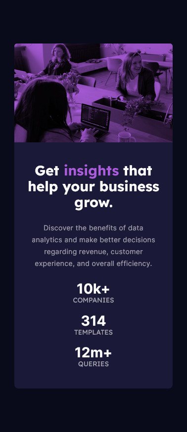

# Frontend Mentor - Stats preview card component solution

This is a solution to the [Stats preview card component challenge on Frontend Mentor](https://www.frontendmentor.io/challenges/stats-preview-card-component-8JqbgoU62). Frontend Mentor challenges help you improve your coding skills by building realistic projects.

## Table of contents

- [Overview](#overview)
  - [The challenge](#the-challenge)
  - [Screenshot](#screenshot)
  - [Links](#links)
- [My process](#my-process)
  - [Built with](#built-with)
  - [Continued development](#continued-development)
- [Author](#author)

## Overview

### The challenge

Users should be able to:

- View the optimal layout depending on their device's screen size

### Screenshot

### Links

- Solution URL: [https://github.com/jayAEY/stats-preview-card-component-main](https://github.com/jayAEY/stats-preview-card-component-main)
- Live Site URL: [https://jayaey.github.io/stats-preview-card-component-main/](https://jayaey.github.io/stats-preview-card-component-main/)

## My process

### Built with

- Semantic HTML5 markup
- CSS custom properties
- Flexbox
- Mobile-first workflow
- [React](https://reactjs.org/) - JS library
- [TailwindCSS](https://nextjs.org/) - CSS framework
- [Vite](https://vitejs.dev/) - Frontend Build Tool

### Continued development

Although fairly simple, this was a good way to practice using Tailwind. It was also good for practicing the setup of a project with Vite. In the future I'd like to keep practicing until I get comfortable with these technologies.

**Note: Delete this note and replace the list above with resources that helped you during the challenge. These could come in handy for anyone viewing your solution or for yourself when you look back on this project in the future.**

## Author

- Frontend Mentor - [@jayAEY](https://www.frontendmentor.io/profile/jayAEY)
